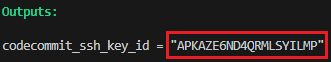
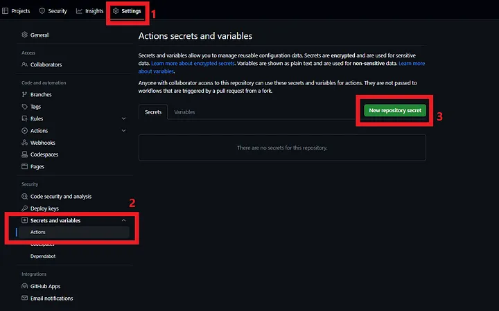

<!-- BEGIN_TF_DOCS -->
## Mirror configuration

After executing
```
terraform apply
```

 see the output variable
```
codecommit_ssh_key_id
```
and copy the value.



In the [ai-document-based-lambda](https://github.com/HarissonNascimento/ai-document-based-lambda) repository, go to **Settings > Secrets and variables > Actions > New repository secret**



Create 2 secrets in the repository

> | Key | Value |
> |---|---|
> | CODECOMMIT\_SSH\_PRIVATE\_KEY | privatekey.pem (RSA Private Key Content, file in this repo) |
> | CODECOMMIT\_SSH\_PRIVATEKEY\_ID | APKXXXXXXXXXXXXXXXXX (SSH Key, copied in the previous step) |

---

## Requirements

| Name | Version |
|------|---------|
| <a name="requirement_terraform"></a> [terraform](#requirement\_terraform) | >=1.8.0 |
| <a name="requirement_aws"></a> [aws](#requirement\_aws) | ~> 5.46.0 |
| <a name="requirement_tls"></a> [tls](#requirement\_tls) | ~> 4.0.5 |

## Providers

| Name | Version |
|------|---------|
| <a name="provider_aws"></a> [aws](#provider\_aws) | 5.46.0 |
| <a name="provider_tls"></a> [tls](#provider\_tls) | 4.0.5 |

## Modules

No modules.

## Resources

| Name | Type |
|------|------|
| [aws_codecommit_repository.ai_document_based_repository](https://registry.terraform.io/providers/hashicorp/aws/latest/docs/resources/codecommit_repository) | resource |
| [aws_iam_user.codecommit_user](https://registry.terraform.io/providers/hashicorp/aws/latest/docs/resources/iam_user) | resource |
| [aws_iam_user_policy_attachment.codecommit_attach](https://registry.terraform.io/providers/hashicorp/aws/latest/docs/resources/iam_user_policy_attachment) | resource |
| [aws_iam_user_ssh_key.codecommit_ssh_key](https://registry.terraform.io/providers/hashicorp/aws/latest/docs/resources/iam_user_ssh_key) | resource |
| [aws_iam_policy.codecommit_policy](https://registry.terraform.io/providers/hashicorp/aws/latest/docs/data-sources/iam_policy) | data source |
| [tls_public_key.codecommit_public_key](https://registry.terraform.io/providers/hashicorp/tls/latest/docs/data-sources/public_key) | data source |

## Inputs

No inputs.

## Outputs

| Name | Description |
|------|-------------|
| <a name="output_codecommit_ssh_key_id"></a> [codecommit\_ssh\_key\_id](#output\_codecommit\_ssh\_key\_id) | The SSH Key ID for codecommit user |
<!-- END_TF_DOCS -->